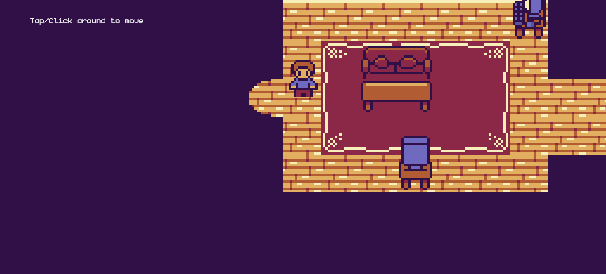

# Sandip's 2D Interactive Portfolio



Welcome to my 2D interactive portfolio. This project is a creative, game-like showcase of my skills and personality, built with JavaScript and the Kaboom.js game library. It's designed to be a fun and memorable alternative to a traditional portfolio.

**[Live Demo](https://sandip387.github.io/2D-PORTFOLIO/)**

## About This Project

This portfolio is a top-down 2D world where you can walk around and interact with different objects in my "virtual room." Each object provides a piece of information about me, my skills, my projects, or my contact details.

The goal was to demonstrate my versatility as a developer and my ability to work with modern web technologies in a creative way, including state management, asset loading, and collision detection within a game loop.

## Features

-   **Interactive World:** Walk around the map by tapping or clicking.
-   **Dialogue System:** Interact with objects like my PC, resume, and projects to learn more about me.
-   **Dynamic UI:** The dialogue box is rendered with HTML/CSS, separate from the game canvas, for clean and scalable text.
-   **Responsive Design:** The camera scale adjusts to different screen sizes for a consistent experience on desktop and mobile.


## Tech Stack

This project was built using a lightweight and modern stack:

-   **Game Engine:** [Kaboom.js](https://kaboomjs.com/) - A fun and fast JavaScript library for making games.
-   **Build Tool:** [Vite](https://vitejs.dev/) - A next-generation frontend tooling that provides a fast development experience.
-   **Deployment:** [GitHub Pages](https://pages.github.com/) with [GitHub Actions](https://github.com/features/actions) for continuous integration and continuous deployment (CI/CD).
-   **Languages:** JavaScript, HTML5, CSS3
-   **Level Design:** [Tiled Map Editor](https://www.mapeditor.org/) - Used to create the JSON-based game map.

## Running the Project Locally

To run this project on your local machine, follow these steps:

1.  **Clone the repository:**
    ```bash
    git clone https://github.com/sandip387/2D-PORTFOLIO.git
    ```

2.  **Navigate to the project directory:**
    ```bash
    cd 2D-PORTFOLIO
    ```

3.  **Install the dependencies:**
    ```bash
    npm install
    ```

4.  **Start the development server:**
    ```bash
    npm run dev
    ```

The application will be available at `http://localhost:5173` (or the next available port).

## Deployment

This site is automatically deployed to GitHub Pages whenever a push is made to the `main` branch. The deployment workflow is defined in the `.github/workflows/deploy.yml` file.

The key configuration for deploying a Vite project to a subdirectory on GitHub Pages is in the `vite.config.js` file:
```javascript
// vite.config.js
export default defineConfig({
  base: "/2D-PORTFOLIO/",
  // ...
});